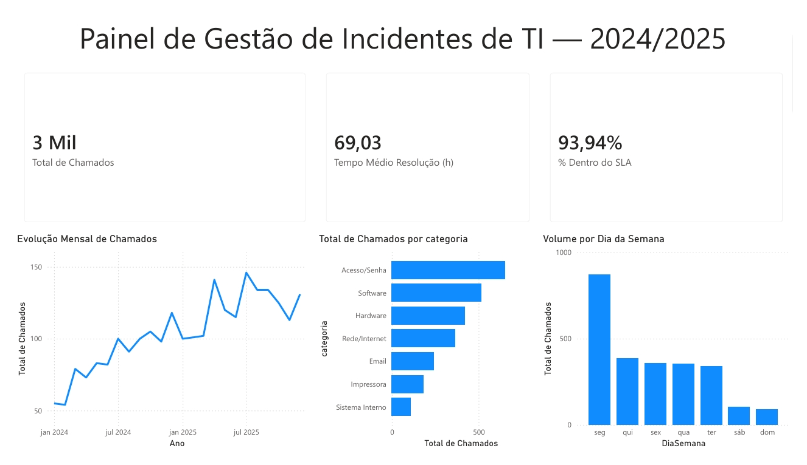

# 📊 Dashboard de Gestão de Incidentes de TI

Painel analítico construído em Power BI para análise de registros de chamados técnicos, aplicando técnicas de **recorrência, tendência, correlação e sazonalidade**.

> ⚠️ **Aviso:** os dados utilizados neste projeto são **sintéticos**, gerados para fins de estudo e demonstração de portfólio. Não representam dados reais de nenhuma organização.



## 🎯 Objetivo

Demonstrar a aplicação prática de Business Intelligence na análise de incidentes de TI, transformando dados operacionais em insights acionáveis para a tomada de decisão.

## 🛠️ Ferramentas Utilizadas

- **Power BI Desktop** — modelagem, medidas DAX e visualização
- **Power Query** — tratamento e limpeza dos dados
- **DAX** — criação de medidas para KPIs e análises
- **CSV** — formato de origem dos dados

## 📈 Estrutura do Painel

**KPIs principais:**
- Total de chamados no período
- Tempo médio de resolução (horas)
- % de chamados dentro do SLA

**Análises visuais:**
- **Evolução mensal** — tendência de volume de chamados ao longo do tempo
- **Top categorias** — análise de recorrência dos tipos de incidente
- **Volume por dia da semana** — identificação de padrões de sazonalidade

## 💡 Principais Insights

1. **Crescimento sustentado:** o volume mensal de chamados apresenta tendência de alta entre 2024 e 2025, indicando necessidade de dimensionamento da equipe de suporte.

2. **Concentração em acesso/senha:** mais de **25% dos chamados** são da categoria *Acesso/Senha*, sugerindo oportunidades de automação (autosserviço de reset) ou de capacitação dos usuários.

3. **Pico sazonal nas segundas-feiras:** o volume na segunda é aproximadamente **2,5x maior** que nos demais dias úteis, recomendando reforço de equipe no início da semana.

4. **Performance de SLA acima de 93%** — bom indicador operacional, mas o monitoramento contínuo é necessário para sustentar o nível com o crescimento da demanda.

## 🗂️ Estrutura do Repositório

```
dashboard-incidentes-ti/
├── data/
│   └── chamados_ti.csv          # Base sintética de 2.500 chamados (2024–2025)
├── dashboard/
│   └── dashboard_incidentes_ti.pbix
├── images/
│   └── dashboard_preview.png
└── README.md
```

## 🧮 Medidas DAX Utilizadas

```dax
Total de Chamados = COUNTROWS(chamados_ti)

Chamados Resolvidos =
CALCULATE([Total de Chamados], chamados_ti[status] = "Resolvido")

Tempo Médio Resolução (h) =
AVERAGE(chamados_ti[tempo_resolucao_horas])

% Dentro do SLA =
DIVIDE(
    CALCULATE([Total de Chamados], chamados_ti[dentro_sla] = "Sim"),
    CALCULATE([Total de Chamados], chamados_ti[dentro_sla] <> "")
)
```

## 🚀 Próximos Passos

- **Projeto 2:** modelagem relacional em SQL com análises avançadas de reincidência e correlação prioridade × tempo de resolução.
- **Projeto 3:** pipeline end-to-end em Python com detecção de anomalias e validação automatizada da qualidade dos dados.

## 👤 Autor

**João Victor Oliveira Mendes**  
Analista de Dados / BI Júnior  
📍 Taguatinga Norte — DF  
📧 jhon.vm08@gmail.com  
🔗 [LinkedIn](https://www.linkedin.com/in/jo%C3%A3o-victor-oliveira-mendes-9b7055236/) · [GitHub](https://github.com/JoaoVOMendes)
